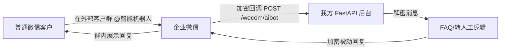

# 企业微信智能机器人 POC 交接文档

## 1. 背景

本项目用于验证“贷款公司自建企业微信智能机器人 + 我方 SaaS 后台”的技术可行性。

业务目标：

1. 员工在企业微信外部客户群中加入智能机器人。
2. 普通微信客户在群里 `@机器人` 提问。
3. 机器人后台收到企业微信回调。
4. 后台根据内置 FAQ 做语义匹配并回复。
5. 如果机器人无法回答，则在群里提示转人工，并尝试 `@` 指定员工。
6. 后续扩展账期提醒：员工发送账期信息后，后台保存并在到期前主动提醒群。

当前交接的代码只做第一阶段 POC：验证 `@机器人 -> 回调 -> 自动回复/转人工 -> response_url 主动回复`。

第二阶段再验证长连接模式下的“无客户消息触发，机器人主动往群里发账期提醒”。

## 2. 当前项目状态

项目目录：

```text
E:\wechat-rpa
```

核心文件：

```text
app/main.py             FastAPI 入口，提供企业微信回调接口
app/wecom_crypto.py     企业微信消息加解密逻辑
app/bot_logic.py        POC 版 FAQ 匹配、上下文记忆、转人工逻辑
.env.example            环境变量示例
requirements.txt        Python 依赖
README.md               简版启动说明
docs/POC_HANDOFF.md     本交接文档
```

已完成的本地验证：

1. Python 依赖安装成功。
2. 企业微信 AES 加解密自测通过。
3. `/wecom/aibot` 的 GET URL 验证模拟通过。

尚未完成的真实企微验证：

1. 企业微信后台 URL 保存验证。
2. 外部客户群中客户 `@机器人` 后是否能收到回调。
3. 机器人是否能在外部客户群内回复。
4. `response_url` 是否能在 1 小时内主动回复。
5. 转人工时 `<@userid>` 是否能真正提醒员工。
6. 是否能 `@普通微信客户`，这个需要实测，不要提前承诺。

## 3. 技术路线

当前采用“客户自建机器人 + 我方 SaaS 后台”模式：



账期提醒第二阶段可选两条路线：

1. 短连接 Webhook：只能在收到客户消息回调后使用 `response_url` 回复，`response_url` 1 小时有效且只能调用一次。
2. 长连接 WebSocket：官方支持 `aibot_send_msg` 主动向单聊或群聊发消息，更适合定时账期提醒。

## 4. 需要准备的企微资源

由贷款公司或测试企业微信管理员准备：

1. 测试企业微信管理员权限。
2. 一个测试员工账号。
3. 一个普通微信测试号，用来模拟客户。
4. 一个测试外部客户群，至少包含：
   - 企业微信员工
   - 普通微信客户
   - 智能机器人
5. 企业微信后台创建一个“智能机器人”。
6. 智能机器人开启 API 模式，第一阶段先用“设置接收消息回调地址”模式。

需要从企业微信后台拿到：

```text
Token
EncodingAESKey
```

第二阶段长连接才需要：

```text
BotID
Secret
```

注意：以上密钥不要写进文档、聊天记录、截图或 Git 仓库。只放本机 `.env` 或服务器安全配置中。

## 5. 本地启动方式

### 5.1 Mac 启动

进入项目目录：

```bash
cd /path/to/wechat-rpa
```

创建虚拟环境：

```bash
python3 -m venv .venv
source .venv/bin/activate
```

安装依赖：

```bash
pip install -r requirements.txt
```

复制环境变量文件：

```bash
cp .env.example .env
```

编辑 `.env`：

```ini
WECOM_AIBOT_TOKEN=企业微信智能机器人Token
WECOM_AIBOT_ENCODING_AES_KEY=企业微信智能机器人EncodingAESKey
WECOM_AIBOT_RECEIVE_ID=
HUMAN_USERID=需要转人工提醒的企业微信员工userid
APP_HOST=0.0.0.0
APP_PORT=8000
```

启动服务：

```bash
uvicorn app.main:app --host 0.0.0.0 --port 8000
```

健康检查：

```bash
curl http://127.0.0.1:8000/health
```

正常返回类似：

```json
{"ok":true,"configured":true}
```

### 5.2 Windows 启动

进入项目目录：

```powershell
cd E:\wechat-rpa
```

创建虚拟环境：

```powershell
python -m venv .venv
.\.venv\Scripts\Activate.ps1
```

安装依赖：

```powershell
pip install -r requirements.txt
```

复制环境变量文件：

```powershell
Copy-Item .env.example .env
```

编辑 `.env` 后启动：

```powershell
uvicorn app.main:app --host 0.0.0.0 --port 8000
```

健康检查：

```powershell
curl http://127.0.0.1:8000/health
```

## 6. 内网穿透

企业微信要求回调地址是公网可访问 HTTPS 地址，本地 `localhost` 不能直接配置。

POC 阶段推荐使用 cloudflared。

### 6.1 Mac 安装 cloudflared

```bash
brew install cloudflared
```

启动临时隧道：

```bash
cloudflared tunnel --url http://localhost:8000
```

启动后终端会输出类似：

```text
https://xxxx.trycloudflare.com
```

企业微信后台回调 URL 填：

```text
https://xxxx.trycloudflare.com/wecom/aibot
```

### 6.2 Windows 安装 cloudflared

可以从 Cloudflare 官方 GitHub Release 下载 Windows 版本：

```text
https://github.com/cloudflare/cloudflared/releases
```

下载后确认命令可用：

```powershell
cloudflared --version
```

启动临时隧道：

```powershell
cloudflared tunnel --url http://localhost:8000
```

企业微信后台回调 URL 同样填：

```text
https://xxxx.trycloudflare.com/wecom/aibot
```

注意：免费临时域名每次重启可能变化，变化后要重新保存企业微信后台配置。

## 7. 企业微信后台配置步骤

1. 登录企业微信管理后台。
2. 进入智能机器人相关配置页面。
3. 创建或编辑一个智能机器人。
4. 开启 API 模式。
5. 第一阶段选择“设置接收消息回调地址”模式。
6. 填写：

```text
URL: https://xxxx.trycloudflare.com/wecom/aibot
Token: 与 .env 中 WECOM_AIBOT_TOKEN 一致
EncodingAESKey: 与 .env 中 WECOM_AIBOT_ENCODING_AES_KEY 一致
```

7. 点击保存。
8. 如果 URL 验证通过，说明 GET 校验链路可用。
9. 将智能机器人加入测试外部客户群。
10. 用普通微信客户在群里发送：

```text
@机器人 申请贷款需要哪些资料
```

## 8. 接口说明

### 8.1 健康检查

```text
GET /health
```

用途：确认服务是否启动、环境变量是否已配置。

### 8.2 企业微信机器人回调

```text
GET /wecom/aibot
POST /wecom/aibot
```

用途：

1. `GET` 用于企业微信保存 URL 时的有效性验证。
2. `POST` 用于接收企业微信加密消息回调。

这两个接口都由企业微信调用，不需要人工手动调用。

### 8.3 查看最近一次回调

```text
GET /debug/last-callback
```

本地浏览器打开：

```text
http://127.0.0.1:8000/debug/last-callback
```

用途：查看最近一次企业微信回调解密后的明文内容。

### 8.4 测试 response_url 主动回复

```text
POST /debug/send-last-response?content=POC主动回复测试
```

Mac：

```bash
curl -X POST "http://127.0.0.1:8000/debug/send-last-response?content=POC主动回复测试"
```

Windows：

```powershell
curl -X POST "http://127.0.0.1:8000/debug/send-last-response?content=POC主动回复测试"
```

注意：

1. 必须先收到一次企业微信消息回调，后台才会保存 `response_url`。
2. `response_url` 有效期 1 小时。
3. 每个 `response_url` 只能调用一次。

## 9. FAQ 匹配逻辑

当前 POC 内置 FAQ 在：

```text
app/bot_logic.py
```

当前问题包括：

```text
申请贷款需要哪些资料
多久可以放款
贷款利率是多少
可以提前还款吗
逾期会有什么影响
还款日是哪天
怎么还款
额度能提高吗
审核没通过怎么办
是否会上征信
```

当前使用 `difflib.SequenceMatcher` 加字符重合度做轻量语义近似匹配，只适合 POC，不适合生产。

生产建议改成：

1. FAQ 标准问题 + 相似问法库。
2. 向量检索召回候选问题。
3. LLM 或规则分类做二次确认。
4. 设置置信度阈值。
5. 未命中时转人工，不要强答。

贷款业务强烈建议不要让大模型自由生成金融承诺类内容，尤其不要自动承诺：

```text
一定能批
一定放款
固定利率
不上征信
无任何费用
```

## 10. 数据和日志

运行后会生成：

```text
data/callbacks.jsonl
data/state.json
```

说明：

1. `callbacks.jsonl` 保存最近收到的企业微信明文回调，方便 POC 排查。
2. `state.json` 保存最近一次 `response_url`、`chatid` 等临时状态。
3. `data/` 已加入 `.gitignore`，不要提交。

生产环境不能这样存敏感会话数据，必须改成合规数据库，并做好权限、审计、脱敏和数据保留策略。

## 11. 验收清单

第一阶段 POC 通过标准：

```text
[ ] /health 返回 ok=true, configured=true
[ ] 企业微信后台 URL 验证通过
[ ] 智能机器人能加入外部客户群
[ ] 普通微信客户 @机器人 后，/debug/last-callback 能看到明文回调
[ ] 命中 FAQ 时，群内能看到机器人回复
[ ] 未命中 FAQ 时，群内能看到转人工提示
[ ] HUMAN_USERID 配置后，转人工消息能否有效 @员工
[ ] /debug/send-last-response 能通过 response_url 发出一次主动回复
```

第二阶段 POC 通过标准：

```text
[ ] 切换智能机器人长连接模式
[ ] 使用 BotID/Secret 建立 WebSocket 长连接
[ ] 通过 aibot_send_msg 主动给群发消息
[ ] 主动提醒能否 @员工
[ ] 主动提醒能否 @普通微信客户
[ ] 账期消息结构化录入并定时触发提醒
```

## 12. 常见问题排查

### 12.1 企业微信后台 URL 验证失败

优先检查：

1. `uvicorn` 是否正在运行。
2. `cloudflared` 是否正在运行。
3. 企业微信配置的 URL 是否是：

```text
https://xxxx.trycloudflare.com/wecom/aibot
```

4. `.env` 里的 `Token` 是否和企业微信后台完全一致。
5. `.env` 里的 `EncodingAESKey` 是否和企业微信后台完全一致。
6. 修改 `.env` 后是否重启了 `uvicorn`。
7. cloudflared 临时域名是否变了。

### 12.2 /health 显示 configured=false

说明 `.env` 没填好或服务没读到配置。

检查：

```text
WECOM_AIBOT_TOKEN
WECOM_AIBOT_ENCODING_AES_KEY
```

这两个必须非空。

### 12.3 客户 @机器人 后没有回调

检查：

1. 客户是否真的在群里 `@智能机器人`。
2. 是否把机器人加入了正确的外部客户群。
3. 机器人是否开启 API 模式。
4. 企业微信后台是否保存的是当前 cloudflared 域名。
5. 终端是否有请求日志。
6. 该外部客户群是否支持智能机器人回调，这一点需要真实验证。

### 12.4 有回调但群里没有回复

检查：

1. `POST /wecom/aibot` 是否返回 200。
2. 终端是否有异常栈。
3. 加密返回格式是否被企业微信接受。
4. 当前回复类型是 `stream`，如果企业微信侧不展示，可临时切换为模板卡片或使用 `response_url` 主动回复继续验证。

### 12.5 转人工没有 @到员工

当前 POC 在消息里拼接：

```text
<@userid>
```

是否能真正提醒员工需要企业微信客户端实测。若不生效，生产方案建议改成：

1. 群内提示“已转人工”。
2. 同时通过企业微信应用消息直接通知员工。
3. 或发送到内部工作群 webhook。

### 12.6 不能 @普通微信客户

这是预期风险之一。企业微信外部客户群对普通微信客户的 @ 能力可能有限，必须实测。

如果不能 @客户，可替代为：

1. 群内写客户昵称提醒。
2. 同时通知负责员工跟进。
3. 使用客户群 SOP 或员工确认发送机制。

## 13. 生产化改造建议

POC 通过后，不建议直接上线当前代码。需要做以下改造：

1. 多租户配置：每家贷款公司一套 `corp_id / bot_id / token / aes_key`。
2. 密钥管理：密钥加密存储，不能放普通配置文件。
3. 数据库：保存群、客户、员工、账期、对话上下文。
4. FAQ 后台：支持运营人员维护问题、答案、相似问法和启停状态。
5. 审核机制：金融相关回答建议先配置标准话术，必要时人工审核。
6. 转人工链路：不仅群里提示，还要单独通知员工。
7. 账期解析：员工发送固定格式，避免自然语言误解析。
8. 定时任务：账期 T-3、T-1、T 当天提醒。
9. 合规审计：记录机器人回复、命中依据、转人工原因。
10. 会话数据合规：如果接入会话内容存档，必须处理授权和告知。
11. 监控告警：回调失败、解密失败、回复失败、长连接断开都要告警。
12. 灰度发布：先选少量员工和客户群验证。

## 14. 官方文档参考

智能机器人概述：

```text
https://developer.work.weixin.qq.com/document/path/101039
```

接收消息：

```text
https://developer.work.weixin.qq.com/document/path/100719
```

被动回复消息：

```text
https://developer.work.weixin.qq.com/document/path/101031
```

回调和回复加解密：

```text
https://developer.work.weixin.qq.com/document/path/101033
```

主动回复消息：

```text
https://developer.work.weixin.qq.com/document/path/101138
```

智能机器人长连接：

```text
https://developer.work.weixin.qq.com/document/path/101463
```

客户群列表：

```text
https://developer.work.weixin.qq.com/document/90000/90135/92120
```

客户群详情：

```text
https://developer.work.weixin.qq.com/document/90000/90135/92122
```

创建企业群发：

```text
https://developer.work.weixin.qq.com/document/90000/90135/92135
```

## 15. 给接手同事的执行顺序

建议按下面顺序执行，不要跳步骤：

1. 在 Mac 或 Windows 本地启动 FastAPI。
2. 打开 `/health`，确认 `configured=true`。
3. 启动 cloudflared，拿到 HTTPS 临时域名。
4. 企业微信后台配置智能机器人回调 URL。
5. 保存并确认 URL 验证通过。
6. 将机器人加入测试外部客户群。
7. 普通微信客户在群里 `@机器人` 提问。
8. 查看群内是否收到机器人回复。
9. 打开 `/debug/last-callback` 查看明文回调。
10. 测试 `/debug/send-last-response`。
11. 记录每一项测试结果，尤其记录失败现象、企业微信客户端截图和后台日志。

最终需要产出一份 POC 结果：

```text
URL验证：通过/失败
客户群加机器人：通过/失败
客户@机器人回调：通过/失败
被动回复：通过/失败
response_url主动回复：通过/失败
转人工@员工：通过/失败
能否@普通微信客户：通过/失败
```

